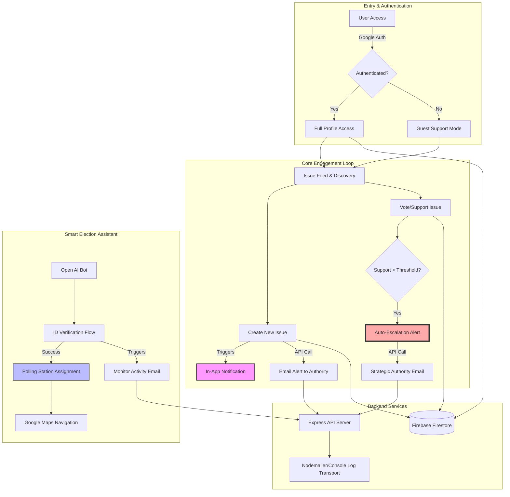

# Community Pulse & Election Assistant Workflow

This diagram outlines the core architectural and user flows of the application.

## Key Processes

1.  **Identity Verification**: The bot uses a mock LLM service to simulate voter roll verification.
2.  **Citizen Escalation**: Once an issue gains enough community support, the system switches from "Community Discussion" to "Official Escalation," triggering direct alerts to pre-defined authority emails.
3.  **Real-time Notifications**: Custom UI toasts track outbound "System Traffic" (emails) to provide transparency on when authorities are being reached.
4.  **Navigation Integration**: The system calculates the best route from the user's current location to their assigned polling station using Google Maps Directions API.
